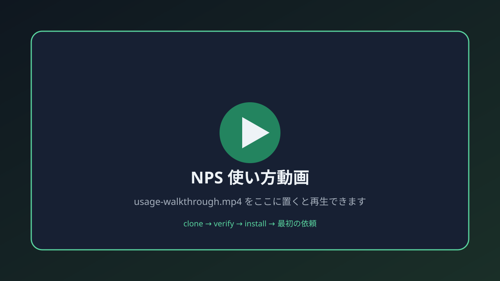

# Note Publishing Suite（NPS）

**書くところまで自動化。公開は、人が決める。**


ローカル素材から Note の下書きを作り、検査し、エディタへ反映する
**NPS（Note Publishing Suite）** です。Codex / Claude Code から使えます。
公開・予約投稿・SNS 共有は自動で行わず、必ず公開直前で止まります。

パッケージ版: `0.2.26`

| すぐやる | あとで読む |
| --- | --- |
| [NPS として使う](#nps-として使う3分) | [できること](#できること) |
| [基本ワークフロー](#基本ワークフロー) | [安全設計](#安全設計) |
| | [入口と詳しい資料](#入口と詳しい資料) |

**動画は不要です。** 下の 3 手順だけで NPS として使えます。

## NPS として使う（3分）

必要なものは POSIX sh、Python、git です。

### 1. 取る・確かめる

```bash
git clone https://github.com/nexus-ai-2045/note-publishing-suite.git
cd note-publishing-suite
sh scripts/verify_public_package.sh
```

Windows では PowerShell verifier も使えます。

```powershell
pwsh -NoProfile -ExecutionPolicy Bypass -File scripts/verify_public_package.ps1
```

`-ExecutionPolicy Bypass` はこのプロセスだけに適用されます。
この verifier は Python と git も使って各 checker を実行するため、
先に利用可能か確認してください。
検証は公開操作を行わず、`embedded copy` と `standalone clone` の契約を確認します。

### 2. Codex に登録する（Windows 推奨）

installer は実体を複製せず、package を指す pointer だけを置きます。

```powershell
pwsh -NoProfile -File adapters/codex/install.ps1 `
  -PackageRoot (Resolve-Path .) `
  -WorkspaceRoot (Resolve-Path .)
```

既定の配置先は `$env:CODEX_HOME\skills`、未設定なら `$HOME\.codex\skills` です。

Claude Code の場合は `adapters/claude-code/install.sh` を使います。

### 3. 最初の依頼例

Codex / Claude に、だいたい次のように頼むと NPS が起動しやすいです。

```text
note-publishing-suite で進めて。
読んでよい素材フォルダは <ここだけ>。
公開・予約・SNSはしない。下書き保存の手前まで。
```

| やりたいこと | 言うこと（例） |
| --- | --- |
| 記事のネタ出し | 「このフォルダから note 記事候補を3つ」 |
| 下書き | 「候補1で note 下書きを作って」 |
| 検査 | 「prepublish QA して」 |
| エディタ反映 | 「Note editor に反映。公開はしない」 |
| 公開判断 | 「publication gate で止まって」 |

固定の `ネタ帳.md` は使いません。入力は、ユーザーが最初に指定した
「読んでよい素材フォルダ」だけです。

全体像は上のワークフロー図だけで足ります。動画撮影は必須ではありません。

<details>
<summary>任意: 使い方動画を後から載せる場合</summary>

動画は **なくても運用できます**。人に見せたいときだけ足してください。

1. 1〜3 分の画面録画を `assets/demo/usage-walkthrough.mp4` に置く  
2. README に次を足す  

```markdown
[](assets/demo/usage-walkthrough.mp4)
```

置き場・台本・禁止事項: [`assets/demo/README.md`](assets/demo/README.md) / [`assets/demo/storyboard.md`](assets/demo/storyboard.md)

</details>

## できること

| できる | 自動では行わない |
| --- | --- |
| 指定素材から記事候補と下書きを作る | 指定外のフォルダや private URL を読む |
| プレビュー、投稿前検査、根拠確認を行う | 記事内容が正しいと断定する |
| Note エディタへ反映し、下書き保存まで進める | 公開、予約投稿、SNS 共有、外部告知 |
| 公開後の確認内容を台帳更新案にする | PV、SEO、おすすめ掲載などの成果を保証する |
| 問答packetと過去文体から、本人の口調・判断を残した下書きを作る | 本人が言っていない感想や結論を作文する |
| 無断短縮、改行、図・キャプション、目次、埋め込みを構造検査する | UI依存操作が常に成功すると断定する |
| Browser切断やtimeoutを分類し、安全な復旧経路へ戻す | processの一括終了や無制限retry |

公開操作には、対象と操作を特定した人間レビューと明示承認が必要です。
`publication_gate: human_review_required`

## 基本ワークフロー

```text
素材を指定 → 記事候補 → 下書き → ローカル検査 → Note 下書き保存 → 公開直前で停止
```

| 段階 | 入口 | 典型コマンド / skill |
| --- | --- | --- |
| 記事候補 | [`note-idea-intake`](skills/note-idea-intake/SKILL.md) | 素材フォルダを指定して候補出し |
| 下書き | [`note-draft-production`](skills/note-draft-production/SKILL.md) | 問答packet → 本文 |
| 投稿前QA | [`note-prepublish-qa`](skills/note-prepublish-qa/SKILL.md) | preview / pre_publish / fact |
| エディタ反映 | [`note-editor-prepublish`](skills/note-editor-prepublish/SKILL.md) | 下書き保存まで |
| 公開停止線 | [`note-publication-gate`](skills/note-publication-gate/SKILL.md) | 公開ボタン手前で停止 |
| 公開後台帳 | [`note-postpublish-ledger`](skills/note-postpublish-ledger/SKILL.md) | URL 確認後のみ |

下書き前には問答packetで本人の言葉、判断、避けたい断言、残したい脱線を確認し、
`voice_profile`と`shortening_budget`を固定します。詳しくは
[`note-draft-authority-and-layout-contract.md`](references/note-draft-authority-and-layout-contract.md)。

## 安全設計

要点だけ先に:

1. 読んでよい素材は、ユーザーが指定したフォルダだけ
2. 公開・予約・SNS は明示承認なしに押さない
3. 根拠ラベル（本人の言葉 / 外部事実 / AI整理）を混ぜない

<details>
<summary>根拠ラベル・provenance（詳細）</summary>

- 根拠は `source_database` / `source_pack`、構成案は `series_plot`、
  `article_plot`、`skeleton`、`wall_bang` として分離します。
- `production_candidate` と `editor_fixture` を混ぜません。詳しくは
  [`note-article-provenance-design.md`](references/note-article-provenance-design.md)。
- `source_pack_locked_with_user_speech_priority` では `user-said`、
  `external-fact`、`assistant-organized`、`hold` を区別します。
- 公開前に `scripts/provenance_leak_check.py --scope changed` を実行します。
  個別denylistは `data/provenance_leak_policy.local.json` に置き、
  公開パッケージへ直書きしない設計です。
- 公開、予約投稿、SNS共有、リポジトリ公開範囲変更は、対象・操作・方式の
  いずれかが不明、または現在の会話で明示承認がない場合は実行しません。

根拠ラベルの確認:

```bash
python scripts/provenance_label_check.py <draft.md> --json
```

AI 作文を含む下書きは、次の順でローカルレビューします。

```bash
python scripts/provenance_label_check.py <draft.md> --json
python scripts/note_preview.py <draft.md> --review-provenance -o <review.html>
python scripts/provenance_label_check.py <draft.md> --public-output <public-body.md>
```

- 「記事を書いて」「文章にまとめて」「会話を記事に」「メモを記事に」
  「下書きを直して」も下書き制作の自動発火対象です。
- レビュー HTML では、ユーザー発言、確認済み外部事実、AI による整理・
  言い換え、未確認・人間判断待ちを色分けします。
- 修正対象は内部 ID ではなく、見出しまたは本文の短い引用で指定できます。
- `hold` が残る間は公開本文候補を書き出しません。公開本文候補では
  ローカル管理用の由来コメントを除去します。

</details>

<details>
<summary>Note エディタの詳しい境界</summary>

## Note エディタの境界

接続できる場合に限り、タイトル、本文、リンク、画像、タグなどを反映します。
下書き保存までで止まり、公開・投稿・予約確定ボタンは押しません。

- 低レベル操作: [`note-editor-ops`](skills/note-editor-ops/SKILL.md)
- 公式機能の棚卸し: [`note-editor-capability-inventory.md`](references/note-editor-capability-inventory.md)
- 1 cycle / 1 action: [`note-editor-pdca-orchestration.md`](references/note-editor-pdca-orchestration.md)
- 実画面の制約: [`note-editor-live-constraint-boundaries.md`](references/note-editor-live-constraint-boundaries.md)
- 画像アップロード停止線: [`note-image-upload-automation-boundary.md`](references/note-image-upload-automation-boundary.md) / `scripts/note_image_upload_boundary_check.py`
- 公式情報: `note-official-guidance-intake`、制約調査: `note-editor-constraint-debug`

リンクカードはURLを単独行に置いて Enter を押し、`figure[data-src]` などの
DOMで確認します。同期しない場合や固定座標が必要な場合は手動境界へ切り替えます。
Noteログイン、常時接続、画像アップロードの完全自動化は保証しません。

</details>

## 入口と詳しい資料

| 目的 | 参照先 |
| --- | --- |
| プロジェクト境界と現在地 | [PROJECT_SSOT.md](PROJECT_SSOT.md) |
| Codex から使う | [SKILL.md](SKILL.md) |
| 機械可読の契約 | [package.yaml](package.yaml) |
| 今後の計画 | [ROADMAP.md](ROADMAP.md) |
| 公開前の準備 | [PUBLIC_READY.md](PUBLIC_READY.md) / [PUBLIC_RELEASE_CHECKLIST.md](PUBLIC_RELEASE_CHECKLIST.md) |
| セキュリティ | [SECURITY.md](SECURITY.md) |
| 変更履歴 | [CHANGELOG.md](CHANGELOG.md) |
| （任意）デモ動画の置き場 | [assets/demo/README.md](assets/demo/README.md) |

<details>
<summary>主な補助ツール一覧</summary>

- `scripts/note_preview.py`: ローカルプレビュー。
- `scripts/review_draft.py`: `build-context-card` と `review-draft`。
- `scripts/note_diff_check.py` / `scripts/fetch_note_body.js`: 公開本文の取得・差分確認。
- `scripts/post_publish.py`: 既定はドライランの台帳更新。
- `scripts/bump_package_version.py`: patch / minor / major を自動採番。
- `scripts/docs_sync_check.py`: 生成物と関連文書をread-onlyで同期検査。
- `scripts/note_interview_packet.py`: 低負担な問答packetを生成。
- `scripts/note_authorship_gate.py`: 本人発言にない作文や無断短縮を検査。
- `scripts/note_linebreak_gate.py` / `scripts/note_figure_structure_gate.py`: 改行、図、captionを検査。
- `scripts/note_browser_transport_recovery.py` / `scripts/note_editor_timeout_recovery.py`: Browser切断とtimeoutを分類。前者はread-only復旧計画専用で、process終了や人間承認の真正性確認は行わない。
- `scripts/note_editor_pdca_failure_check.py`: Note editor 失敗パターン台帳を検査。
- `scripts/topic_status_check.py`: 話題統合台帳の配線を検査。
- `scripts/package_consistency_check.py`: 宣言したスクリプトの実在を検査。
- `adapters/codex/install.ps1`: WindowsのCodex skill pointerを配置し、参照切れを検査。

</details>

## PRごとのドキュメント同期

`package.yaml`の`docs_sync_contract`を正本として、変更pathに対応する文書更新と
`README.rendered.html`の生成差分を検査します。通常検査はrepositoryを変更せず、
不足時は`generated_drift`、`missing_doc_review`、`missing_required_doc`を返します。

```bash
python scripts/docs_sync_check.py --base-ref origin/main
```

PRでは`.github/workflows/test.yml`が`contents: read`だけで実行します。失敗時は
検査JSONと生成物patchをartifactに残しますが、commit、push、PR編集は行いません。
ローカルで生成物だけ直す場合は、明示的に`--fix-generated`を付けます。

<details>
<summary>開発者向けの検証と保証</summary>

## 開発・検証

```bash
python scripts/render_readme.py
python scripts/docs_sync_check.py --base-ref origin/main
python scripts/review_draft.py build-context-card content/drafts/sample-note-prepublish-fixture.md --json
python scripts/review_draft.py review-draft content/drafts/sample-note-prepublish-fixture.md --json
python scripts/note_editor_prepublish_verify.py data/note_editor_prepublish_observation.fixture.json --json
python scripts/run_local_draft_qa_proof.py --json
python scripts/japanese_closeout_language_check.py --json
python scripts/note_image_upload_boundary_check.py --json
python scripts/note_editor_pdca_failure_check.py --json
python scripts/topic_status_check.py --json
python -m pytest scripts/test_skill_integration.py tests
```

包括検証は `sh scripts/verify_public_package.sh` です。`verify:local` は、
公開操作なしで構成、安全境界、README表示、公開前停止線を確認します。

日本語報告の `ready for review` は下書き解除済み、`open PR` は未マージPR、
`MERGED` はマージ済み、`mergeable` はマージ可能です。これらを英語のまま
報告した場合は文章ミスではなく、構造バグとして出力ゲートを修正します。
コマンド、ファイルパス、URL、SHA、識別子は原文のまま扱います。

## 保証ラチェット

失敗や手動境界は、原因・復旧方法・次回の禁止事項を残します。再発防止できる
ものは検査器、契約テスト、スキルへ反映し、UI依存は無理に自動化しません。

GitHubではこのREADMEをそのまま読めます。ローカル整形版は
`python scripts/render_readme.py` で `README.rendered.html` に生成できます。

</details>
