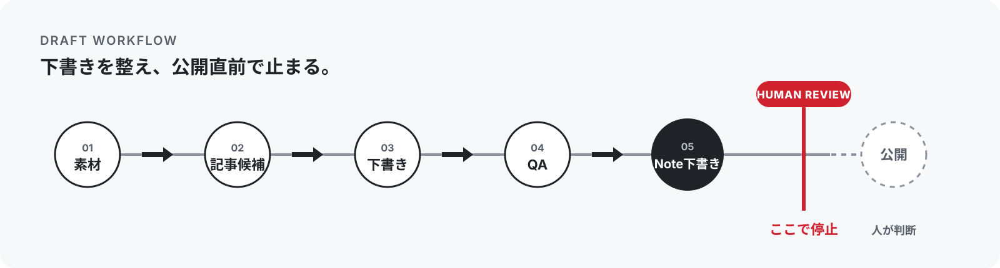

# Note Publishing Suite

**書くところまで自動化。公開は、人が決める。**



ローカル素材から Note の下書きを作り、検査し、エディタへ反映する
Codex 向けパッケージです。公開・予約投稿・SNS 共有は自動で行わず、
必ず公開直前で止まります。

パッケージ版: `0.2.19`

[3分で始める](#3分で始める) · [安全設計](#安全設計) · [詳しい資料](#入口と詳しい資料)

## できること

| できる | 自動では行わない |
| --- | --- |
| 指定素材から記事候補と下書きを作る | 指定外のフォルダや private URL を読む |
| プレビュー、投稿前検査、根拠確認を行う | 記事内容が正しいと断定する |
| Note エディタへ反映し、下書き保存まで進める | 公開、予約投稿、SNS 共有、外部告知 |
| 公開後の確認内容を台帳更新案にする | PV、SEO、おすすめ掲載などの成果を保証する |

公開操作には、対象と操作を特定した人間レビューと明示承認が必要です。

## 3分で始める

必要なものは POSIX sh、Python、git です。

```bash
git clone https://github.com/nexus-ai-2045/note-publishing-suite.git
cd note-publishing-suite
sh scripts/verify_public_package.sh
```

Windows では PowerShell verifier も使えます。

```powershell
pwsh -NoProfile -ExecutionPolicy Bypass -File scripts/verify_public_package.ps1
```

`-ExecutionPolicy Bypass` はこのプロセスだけに適用されます。
この verifier は Python と git も使って各 checker を実行するため、
先に利用可能か確認してください。
検証は公開操作を行わず、`embedded copy` と `standalone clone` の契約を確認します。

## 基本ワークフロー

```text
素材を指定 → 記事候補 → 下書き → ローカル検査 → Note 下書き保存 → 公開直前で停止
```

| 段階 | 入口 |
| --- | --- |
| 記事候補 | [`note-idea-intake`](skills/note-idea-intake/SKILL.md) |
| 下書き | [`note-draft-production`](skills/note-draft-production/SKILL.md) |
| 投稿前QA | [`note-prepublish-qa`](skills/note-prepublish-qa/SKILL.md) |
| エディタ反映 | [`note-editor-prepublish`](skills/note-editor-prepublish/SKILL.md) |
| 公開停止線 | [`note-publication-gate`](skills/note-publication-gate/SKILL.md) |
| 公開後台帳 | [`note-postpublish-ledger`](skills/note-postpublish-ledger/SKILL.md) |

固定の `ネタ帳.md` は使いません。入力は、ユーザーが最初に指定した
「読んでよい素材フォルダ」だけです。

## 安全設計

- 根拠は `source_database` / `source_pack`、構成案は `series_plot`、
  `article_plot`、`skeleton`、`wall_bang` として分離します。
- `production_candidate` と `editor_fixture` を混ぜません。詳しくは
  [`note-article-provenance-design.md`](references/note-article-provenance-design.md)。
- `source_pack_locked_with_user_speech_priority` では `user-said`、
  `external-fact`、`assistant-organized`、`hold` を区別します。
- 公開前に `scripts/provenance_leak_check.py --scope changed` を実行します。
  個別denylistは `data/provenance_leak_policy.local.json` に置き、
  公開パッケージへ直書きしない設計です。
- 公開、予約投稿、SNS共有、リポジトリ公開範囲変更は、対象・操作・方式の
  いずれかが不明、または現在の会話で明示承認がない場合は実行しません。

根拠ラベルの確認:

```bash
python scripts/provenance_label_check.py <draft.md> --json
```

AI 作文を含む下書きは、次の順でローカルレビューします。

```bash
python scripts/provenance_label_check.py <draft.md> --json
python scripts/note_preview.py <draft.md> --review-provenance -o <review.html>
python scripts/provenance_label_check.py <draft.md> --public-output <public-body.md>
```

- 「記事を書いて」「文章にまとめて」「会話を記事に」「メモを記事に」
  「下書きを直して」も下書き制作の自動発火対象です。
- レビュー HTML では、ユーザー発言、確認済み外部事実、AI による整理・
  言い換え、未確認・人間判断待ちを色分けします。
- 修正対象は内部 ID ではなく、見出しまたは本文の短い引用で指定できます。
- `hold` が残る間は公開本文候補を書き出しません。公開本文候補では
  ローカル管理用の由来コメントを除去します。

<details>
<summary>Note エディタの詳しい境界</summary>

## Note エディタの境界

接続できる場合に限り、タイトル、本文、リンク、画像、タグなどを反映します。
下書き保存までで止まり、公開・投稿・予約確定ボタンは押しません。

- 低レベル操作: [`note-editor-ops`](skills/note-editor-ops/SKILL.md)
- 公式機能の棚卸し: [`note-editor-capability-inventory.md`](references/note-editor-capability-inventory.md)
- 1 cycle / 1 action: [`note-editor-pdca-orchestration.md`](references/note-editor-pdca-orchestration.md)
- 実画面の制約: [`note-editor-live-constraint-boundaries.md`](references/note-editor-live-constraint-boundaries.md)
- 画像アップロード停止線: [`note-image-upload-automation-boundary.md`](references/note-image-upload-automation-boundary.md) / `scripts/note_image_upload_boundary_check.py`
- 公式情報: `note-official-guidance-intake`、制約調査: `note-editor-constraint-debug`

リンクカードはURLを単独行に置いて Enter を押し、`figure[data-src]` などの
DOMで確認します。同期しない場合や固定座標が必要な場合は手動境界へ切り替えます。
Noteログイン、常時接続、画像アップロードの完全自動化は保証しません。

</details>

## 入口と詳しい資料

| 目的 | 参照先 |
| --- | --- |
| プロジェクト境界と現在地 | [PROJECT_SSOT.md](PROJECT_SSOT.md) |
| Codex から使う | [SKILL.md](SKILL.md) |
| 機械可読の契約 | [package.yaml](package.yaml) |
| 今後の計画 | [ROADMAP.md](ROADMAP.md) |
| 公開前の準備 | [PUBLIC_READY.md](PUBLIC_READY.md) / [PUBLIC_RELEASE_CHECKLIST.md](PUBLIC_RELEASE_CHECKLIST.md) |
| セキュリティ | [SECURITY.md](SECURITY.md) |
| 変更履歴 | [CHANGELOG.md](CHANGELOG.md) |

主な補助ツール:

- `scripts/note_preview.py`: ローカルプレビュー。
- `scripts/review_draft.py`: `build-context-card` と `review-draft`。
- `scripts/note_diff_check.py` / `scripts/fetch_note_body.js`: 公開本文の取得・差分確認。
- `scripts/post_publish.py`: 既定はドライランの台帳更新。
- `scripts/bump_package_version.py`: patch / minor / major を自動採番。
- `scripts/docs_sync_check.py`: 生成物と関連文書をread-onlyで同期検査。

## PRごとのドキュメント同期

`package.yaml`の`docs_sync_contract`を正本として、変更pathに対応する文書更新と
`README.rendered.html`の生成差分を検査します。通常検査はrepositoryを変更せず、
不足時は`generated_drift`、`missing_doc_review`、`missing_required_doc`を返します。

```bash
python scripts/docs_sync_check.py --base-ref origin/main
```

PRでは`.github/workflows/test.yml`が`contents: read`だけで実行します。失敗時は
検査JSONと生成物patchをartifactに残しますが、commit、push、PR編集は行いません。
ローカルで生成物だけ直す場合は、明示的に`--fix-generated`を付けます。

<details>
<summary>開発者向けの検証と保証</summary>

## 開発・検証

```bash
python scripts/render_readme.py
python scripts/docs_sync_check.py --base-ref origin/main
python scripts/review_draft.py build-context-card content/drafts/sample-note-prepublish-fixture.md --json
python scripts/review_draft.py review-draft content/drafts/sample-note-prepublish-fixture.md --json
python scripts/note_editor_prepublish_verify.py data/note_editor_prepublish_observation.fixture.json --json
python scripts/run_local_draft_qa_proof.py --json
python scripts/japanese_closeout_language_check.py --json
python scripts/note_image_upload_boundary_check.py --json
python -m pytest scripts/test_skill_integration.py tests
```

包括検証は `sh scripts/verify_public_package.sh` です。`verify:local` は、
公開操作なしで構成、安全境界、README表示、公開前停止線を確認します。

日本語報告の `ready for review` は下書き解除済み、`open PR` は未マージPR、
`MERGED` はマージ済み、`mergeable` はマージ可能です。これらを英語のまま
報告した場合は文章ミスではなく、構造バグとして出力ゲートを修正します。
コマンド、ファイルパス、URL、SHA、識別子は原文のまま扱います。

## 保証ラチェット

失敗や手動境界は、原因・復旧方法・次回の禁止事項を残します。再発防止できる
ものは検査器、契約テスト、スキルへ反映し、UI依存は無理に自動化しません。

GitHubではこのREADMEをそのまま読めます。ローカル整形版は
`python scripts/render_readme.py` で `README.rendered.html` に生成できます。

</details>
